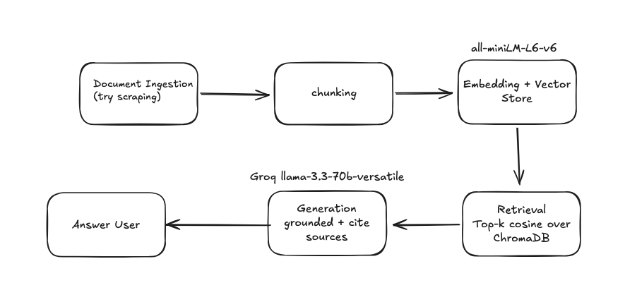

# Project 1 Planning: The Unofficial Guide

> Write this document before you write any pipeline code.
> Your spec and architecture diagram are what you'll use to direct AI tools (Claude, Copilot, etc.) to generate your implementation — the more specific they are, the more useful the generated code will be.
> Update the Retrieval Approach and Chunking Strategy sections if you change your approach during implementation.
> Update this file before starting any stretch features.

---

## Domain

<!-- What domain did you choose? Why is this knowledge valuable and hard to find through official channels? -->

CSULB student reviews of professors and courses in Computer Science. The System answers pratical "which professor should I take and waht the class is actually like". This knowledge is valuable and hard to find through official channels because the catalog and the department site only describe what a course covers, never how it is taught or who teaches it well.

## Documents

<!-- List your specific sources: URLs, subreddit names, forum threads, or file descriptions.
     Aim for at least 10 sources that together cover different subtopics or perspectives within your domain. -->

| #   | Source | Description                                                           | URL or location                                                                                   |
| --- | ------ | --------------------------------------------------------------------- | ------------------------------------------------------------------------------------------------- |
| 1   | RMP    | Professor neal terrel who teaches a variety of courses                | https://www.ratemyprofessors.com/professor/1810660                                                |
| 2   | RMP    | Professor frank murgolo who also teaches a variety of courses         | https://www.ratemyprofessors.com/professor/464926                                                 |
| 3   | RMP    | Professor Susan Nachwati who teaches a vartiety of CS courses         | https://www.ratemyprofessors.com/professor/115586                                                 |
| 4   | RMP    | Professor Hailu Xu who teaches a variety of CS courses                | https://www.ratemyprofessors.com/professor/2639859                                                |
| 5   | RMP    | Professor Steve Gold who also teaches a variety of courses            | https://www.ratemyprofessors.com/professor/307547                                                 |
| 6   | RMP    | Professor Darin Goldstein who teaches a variety of CS courses         | https://www.ratemyprofessors.com/professor/52818                                                  |
| 7   | Reddit | Post about which CS professors students recommend or do not recommend | https://www.reddit.com/r/CSULB/comments/1o7k69s/csulb_students_which_computer_science_professors/ |
| 8   | Reddit | Experience of the CS program at CSULB                                 | https://www.reddit.com/r/CSULB/comments/1ejytkq/why_is_the_cs_program_bad/                        |
| 9   | Reddit | Quality of CS at CSULB                                                | https://www.reddit.com/r/CSULB/comments/14kuu85/quality_of_computer_science_education_in_csulb/   |
| 10  | RMP    | Professor Shannon Cleary who teaches a variety of courses at CSULB    | https://www.ratemyprofessors.com/professor/1287692                                                |

---

## Chunking Strategy

<!-- How will you split documents into chunks?
     State your chunk size (in tokens or characters), overlap size, and explain why those
     numbers fit the structure of your documents.
     A review-heavy corpus warrants different chunking than a long FAQ. -->

**Chunk size:**
one review = one chunk (for RMP) and one comment/post = one chunk for reddit
150~300 tokens (roughly 600-1200 characters). Most RMP reviews fall well under this.
**Overlap:**
30-50 tokens only when splitting a long reddit post
**Reasoning:**
Most reviews are short (1-4 sentences) and splitting a review would make it lose context. Overlap matters only in long-for reddit since it might talk about how ther midterm is all multiple choice in one paragraph but then the final is ree-response in another

---

## Retrieval Approach

<!-- Which embedding model are you using (e.g., all-MiniLM-L6-v2 via sentence-transformers)?
     How many chunks will you retrieve per query (top-k)?
     If you were deploying this for real users and cost wasn't a constraint, what tradeoffs
     would you weigh in choosing a different embedding model — context length, multilingual
     support, accuracy on domain-specific text, latency? -->

**Embedding model:**
all-MiniLM-L6-v2 via sentence-transformers
**Top-k:**
6–10. Because each chunk is a single short opinion, one chunk rarely represents a group agreement of that professor, the LLM needs sveral reviews to synthesize a fair andwer.
**Production tradeoff reflection:**
stronger model like all-mpnet-base-v2 or e5-large distinguishes sentiment more reliably.
Context length: an API model (OpenAI text-embedding-3-large, Voyage, Cohere) with a long context window removes the 256-token cap, so long Reddit posts embed whole and chunking gets simpler.
Latency vs. quality: bigger models are slower and (for APIs) add network round-trips.

---

## Evaluation Plan

<!-- List your 5 test questions with their expected correct answers.
     Questions should be specific enough that you can judge whether the system's response
     is right or wrong. "What are good dining halls?" is too vague.
     "What do students say about wait times at [dining hall name] during lunch?" is testable. -->

| #   | Question                                                                          | Expected answer            |
| --- | --------------------------------------------------------------------------------- | -------------------------- |
| 1   | Are Prof. Neal Terrel's exams multiple-choice or free-response in CECS 323?       | Free response              |
| 2   | Is attendance mandtory for CECS 491B with Professor Frank Murgolo?                | Yes                        |
| 3   | Which professor would you not recommend for CECS174 with for beginner programmer? | Susan Nachawati            |
| 4   | How heavy is the workload for Neal Terrel's classes?                              | moderate                   |
| 5   | How difficult is Neal Terrel's 491B class?                                        | He doesnt teach this class |

---

## Anticipated Challenges

<!-- What could go wrong? Name at least two specific risks with reasoning.
     Consider: noisy or inconsistent documents, missing source attribution, off-topic
     retrieval, chunks that split key information across boundaries. -->

1. Students routinely disagree about the same instructor. The system may surface one side confidently and erase real disagreement.

2. A single Reddit post can discuss three professors; a chunk from it could be attributed to the wrong one without careful metadata.

---

## Architecture

<!-- Draw a diagram of your pipeline showing the five stages:
     Document Ingestion → Chunking → Embedding + Vector Store → Retrieval → Generation
     Label each stage with the tool or library you're using.
     You can use ASCII art, a Mermaid diagram, or embed a sketch as an image.
     You'll use this diagram as context when prompting AI tools to implement each stage. -->

---

## AI Tool Plan

<!-- For each part of the pipeline below, describe:
     - Which AI tool you plan to use (Claude, Copilot, ChatGPT, etc.)
     - What you'll give it as input (which sections of this planning.md, which requirements)
     - What you expect it to produce
     - How you'll verify the output matches your spec

     "I'll use AI to help me code" is not a plan.
     "I'll give Claude my Chunking Strategy section and ask it to implement chunk_text()
     with my specified chunk size and overlap" is a plan. -->

**Milestone 3 — Ingestion and chunking:**

give Claude the Chunking Strategy section + the ingestion requirement, ask it to implement load_documents() and chunk_reviews() that emit chunks with {text, professor, course, source_url, source_type} metadata.

**Milestone 4 — Embedding and retrieval:**

give Claude the Retrieval Approach section, ask it to write embed_and_store() using sentence-transformers + ChromaDB and retrieve(query, k=8) with cosine similarity.

**Milestone 5 — Generation and interface:**

Claude the Grounded Response requirement plus a sample of retrieved chunks, ask it to write a prompt template that forces answers only from context, cites the source_url(s) used, and refuses when context is insufficient
